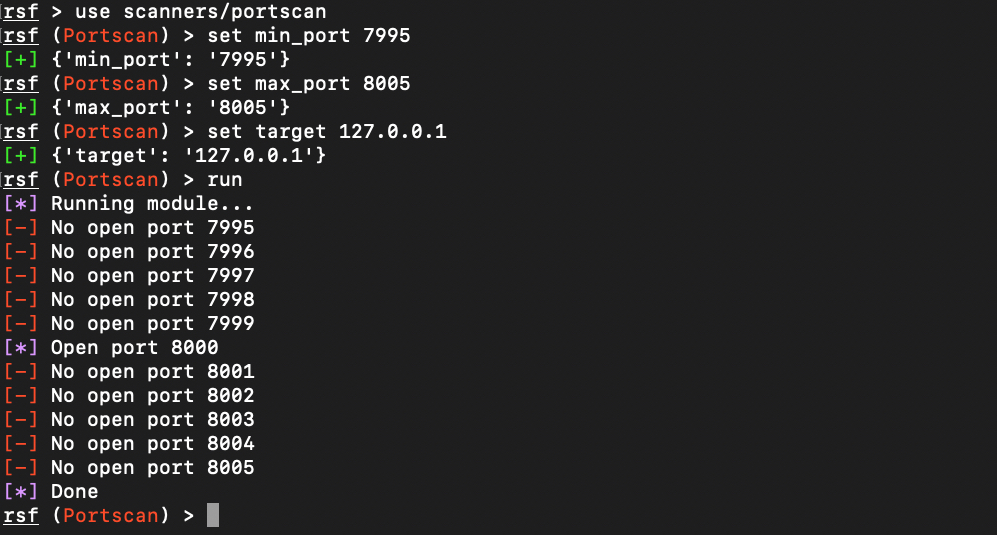

# Botnet Attack Project

## Goal

We want to collect a variety of attacks against IoT devices. These attacks should abuse common vulnerabilities of devices. The attacks or scans should be easily executable within a framework.

## Framework

We use the [routersploit](https://github.com/gh0stsec/routersploit) framework for our attacks.
The framework is written in python. It can be executed with a simple `./rsf.py` using the shebang interpreter.
Routersploit supports separation between "exploits" and "scanners". We decided to add our attacks to the scanners module that then triggers various exploits. The forked project can be found [here](https://github.com/Toberd/routersploit).

## Basic Portscan

To get used to the routersploit framework we started our project by implementing a simple portscan.
It performs a TCP three-way-handshake to check if a certain port of a host is open. If the handshake could be done successfully the port is considered to be open. Otherwise it is closed. The result is printed to the console.

## Testing

Since we cannot run our scanners in a real world IoT lab we need some sort of simulation.
For some protocols there exist docker images that let us spawn a single service running behind a single port (e.g. mysql, telnet).
Our scripts can be executed individually. This is why we think that spawning single services on different containers is perfectly enough. There is no need to combine a lot of services together to simulate a complete IoT device at once.

## Nmap

Nmap is a tool for scanning and analyzing a device for open ports. On top of that, once it found an open port it can have a deeper look if the port leads to a commonly known vulnerability.
There are many scripts available for different types of protocols, e.g. http, ssh, telnet.
Our idea is to pick some cool and relevant scripts and put them into our routersploit framework. They therefore need to be rewritten in Python since they are currently in the NSE (Nmap Scripting Engine) format.

### XSS Tryout

Our first scan is [XSS Tryout](https://github.com/Toberd/routersploit/blob/master/routersploit/modules/exploits/misc/generic/xss_tryout.py). It checks if a target hosts some sort of web interface and if this web interface is possibly vulnerable against cross-site scripting.
We place some commonly used query parameters with special property values in the url and check if they get reflected in the source code of the website.
If so, one can assume that also scripts might be added to the website.

The script works for all IoT devices that expose a web interface or admin panel under a common http port. Although the script can't identify all xss vulnerabilities, there is a certain possibility that the site is xss vulnerable.

#### Testing the script

Basically, you can execute the script on any available website (no warranty if you manage to break the targeted website somehow ;) ).
For testing purposes, we hosted a small website on our localhost. This simple site just prints the data it receives in the `?data=` query without any kind of filtering.
This leads to an xss vulnerability that our script should show.